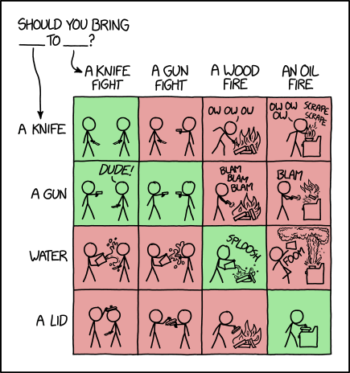

A common interview question is “What are design patterns?”, followed by “What design patterns have you used in your own code?”
Instead, write an essay, perhaps using metaphor or analogy, which by its conclusion has answered these two questions but in a clever, interesting, and informative fashion.

# Design Patterns 
When I was taking Physics there were obvious formulas you'd use for specific problems and if you'd practiced enough you would be able to tell what kind of problem it was just by reading the first few sentences. Lets say you were trying to find how fast an object accelerated at a given time. How would you solve it? The obvious answer would be to solve it using a kinematic equation and not some other thing such as calculating the angular momentum. For problems such as ones regarding an objects velocity and acceleration there are a specific equations used for solving them. The same thing can be said with design patterns. A design pattern is essentially a repeatable solution used to solve commonly occurring problems albeit with some manipulation and adjustment. 

A more recently used design pattern that we have used in our code is the observer pattern. The observer pattern is a pattern where a group of objects have dependencies and when an object changes its dependencies are updated. In Meteor if you change something in a collection this is a "trigger" in which Meteor updates and refreshes the page displaying your changes. While I have had the concept of a design pattern before, I really haven't understood what it meant and how many patterns there were until now. With the ability to see design patterns and hopefully being able to master it later on will give you the ability to understand and improve on the code at hand.  
