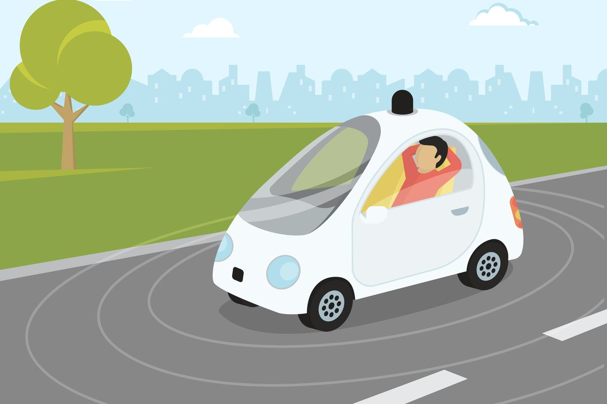

# Ethics
What is right? What is wrong? This is something that gets asked daily. However, in nature, there is no right or wrong. Ethics are a set of moral principles that can only apply to humans since, in a broader sense, ethics are a set of societal rules that makes you seem more civilized.  It is all based on your environment and how you were raised. When it comes to software however it is somewhat of a gray area for me. What is seems completely right to you maybe the complete opposite for another person. Luckily we have a <a href="https://www.acm.org/code-of-ethics">Code of Ethics</a> from ACM (Association of Computing Machinery) which we will use as a guideline heading into our topic of Autonomous Vehicles.

# Who do I kill?
With autonomous vehicles populating the roads in the foreseeable future, questions such as Who to blame for accidents and How secure the software is arises. Many of these questions remain unanswered. However, deciding who gets killed is a choice we have to make. In the event of an unavoidable accident (extremely extremely unlikely), who would you kill? Its a rather tough decision to make as there is a multitude of factors that come into play such as choosing the lesser of the two evils; running over a group old people or a group of kids. What if you were about run over 10 people? Would'nt it be more ethical to sacrifice the yourself if you had the chance? Having this information would you even buy a car that would kill you. These types of things have to be programmed and thought about for software engineers. You can see  <a href="http://moralmachine.mit.edu/">where you stand</a> on this subject by taking MITs moral test. 

# My Stance
I personally think with autonomous cars, it should be a standard that we should harm the least amount of people regardless of sex,race, or status. In the end of the day lives are lives and the more we save the better. This idea of harming the least amount of people come from 1.4 of the ACM Code of Ethics. This idea of being fair and not discriminating I think is important along with 1.2 from the ethics. Harming the least amount of people is the closest thing you can do to following this rule.

