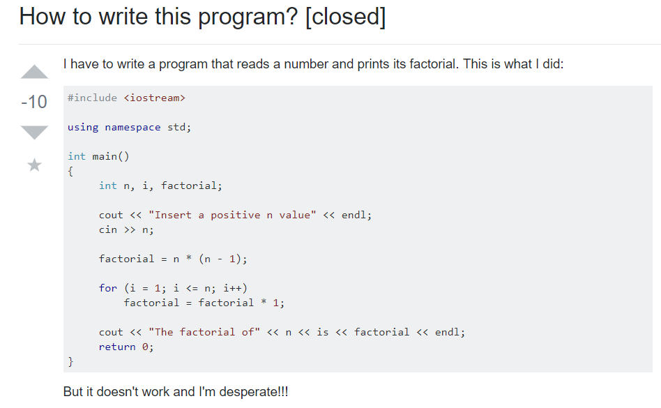
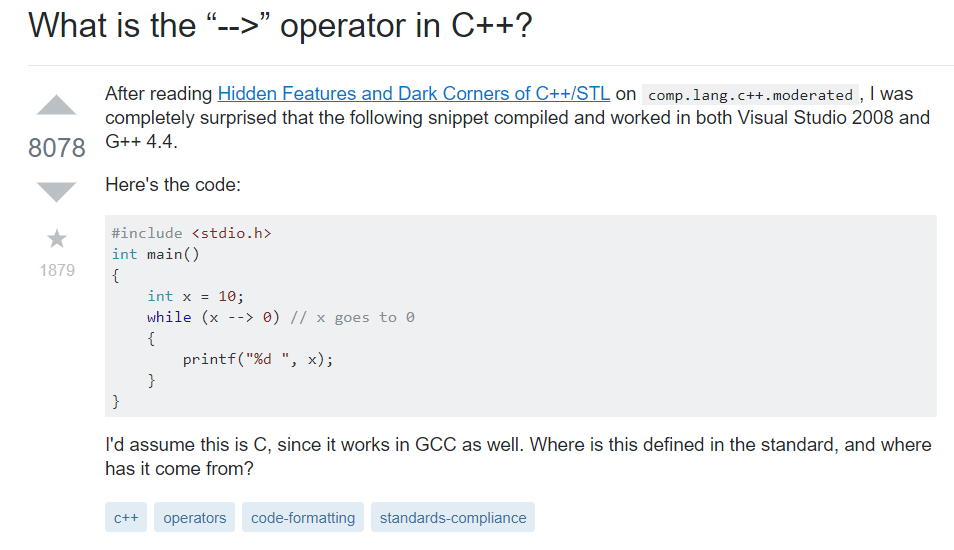

## Time is Key

Time is one of the most valuable things you have and also one of the few things you can never have more of. In the digital age we currently have access to information that scholars would’ve dreamt of right at our fingertips. This access to information that we have is a great power and with that power we have a great responsibility; a responsibility to ask smart questions. To access this power we have a powerful tool called Google, and with this tool you can ask any question you want and almost indefinitely will always receive an answer. In a technical field like software engineering having the skill to know how to ask a smart question is priceless as not only will it save your time, it will help you get to your answer much quicker. The reason why its so important is because a question like “how do I implement this function” can be done a dozen ways in the software world. Writing code is like writing an essay, the more details you add into the question, the more tailored your answer will be. 

## Not so Smart Questions
 Let’s start with an example of a bad question.

There are several things wrong with this question.
0. Title is Ambiguous
0. You could find a solution to their question online
0. They probably didn’t check their own code
0. Adds an unnecessary anecdote at the bottom
All of these things lead to a very bad question being asked. It seems like the person who asked this didn’t even give any effort into asking it. Why would anyone try to put in effort into answering it if so poorly written? Which is why the only solution written up is a short 3 statement answer. 

## Smart Questions
Example of a good question

Reasons why the question was a “smart” one
0. The title is specific
0. They provide context
0. They provide a code snippet
Smart questions are often ones that show effort and this shows as the readers will be able to understand the problem quicker and come up with a better response. Often bad questions are ones that don’t have any context or any details. This leads to insightful solutions which just waste everyone’s time. 

## Conclusion
Instead of asking crying for help every time you run into a problem, use the most powerful tool in your asset; your brain. Think critically on why you have that problem and when you finally reached the end and exercised your resources come up with a smart question.

Source: <a href="https://stackoverflow.com/questions/33204198/how-to-write-this-program">Dumb Question</a>
Source: <a href="https://stackoverflow.com/questions/1642028/what-is-the-operator-in-c">Smart Question</a>

