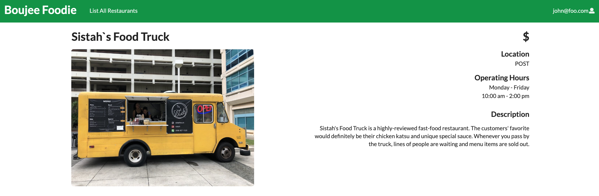

## Overview
Boujee Foodie is the name of our Web Application project built using React and Meteor. The main goal of this project was to display the food vendors operating within the UH Manoa campus on a web app with functionality to that similar of Yelp. Currently the web application users to login and search the avaliable food vendors on campus and view the food vendors information such as hours of operation, price tag, menu, and reviews. The most recent deployment via Galaxy Meteor can be found at [Boujee Foodie](https://boujeefoodie.meteorapp.com). 

## Contributions
We had three milestones for this project. In the first milestone I created the user landing page which is what is displayed to the user when they first come on to the website. For the second milestone, I worked on creating the food vendor information page and worked on being able to delete vendors. For the last milestone I added the review form and functionality to add reviews as well as add more information to be included in the description page of the vendor such as menu and operating hours. 
## Learning Outcome
I gained a lot of experience with issue driven project management as well as working in a team of four while juggling our other classes and projects. We used facebook messenger as a means of contact and planned out what we wanted ahead of time. I gained a lot experience with using Javascript, React, and Meteor to build a web application even though  I was busy with my other classes. 
## Screenshots
### Home Page

### Vendor Page

For more information, you can view the our [Boujee Foodie IO Page](https://boujeefoodie.github.io/) and [Source Code](https://github.com/boujeefoodie/boujeefoodie)
