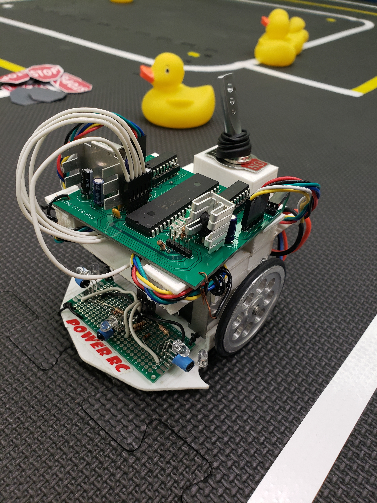

MicroMouse is a competition in which an autonomous robot attempts to get to the middle of the maze. The maze is made up of a 16 by 16 grid of cells, each 180 mm square with walls 50 mm high.

I took on this project with 3 of my friends for our sophomore engineering project. When we were decided how we were going to split up the work we decided that all of us wanted to dabble in everything so everyone had a say and helped with each aspect of the design and fabrication of the mouse. The semester started with all of us wondering what we got ourselves into as none of us had an idea of where or how to start. It eventually got better as we met the upper classeman in the project and they gave us some advice. We started first with a prototype design, drawing and collaborating on how we should implement everything. We decided it would be in our best interest that we build everything from scratch meaning we would have to design our own PCB as well as CAD our own chassis.
 
 
 
After we designed our PCB we noticed that one of the routes were not connected so we had to manually route it via wire. 

I personally learned a lot from that semester and I can say the same for my teammates, as they went through all the struggles together of all those late nights staying in micromouse. I would say critical thinking was a skill that was tested a multitude of times throughout this semester and that drive to pick yourself back up failing to find a problem over and over again as well that dread of seeing your PCB smoking up late at night twice. This project overall gave me technical skills such as working microcontrollers, learning EAGLE, CAD and an introduction to embedded systems. This project also helped strengthened our critical thinking skills as well tested our grit leading to a goal which we set in the beginning to have a mouse that could traverse the maze.

You can check out more about micromouse<a href="http://micromouseusa.com/?page_id=23"> here</a>

